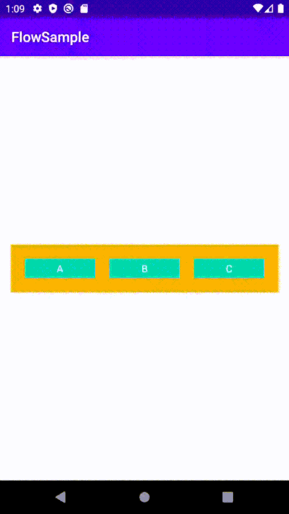

# Simple Flow Sample

Sample to explore constraint layout flow helper's functionality.

1. wrap mode = chain, align to end

   

Reference: https://medium.com/@glebkalinichenkousa/review-virtual-helpers-in-constraint-layout-2-0-beb5f9319693
